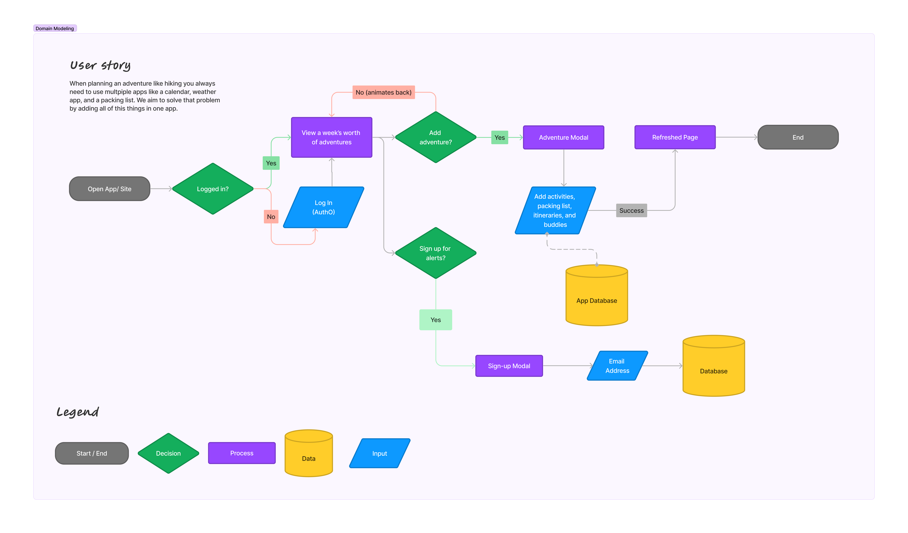
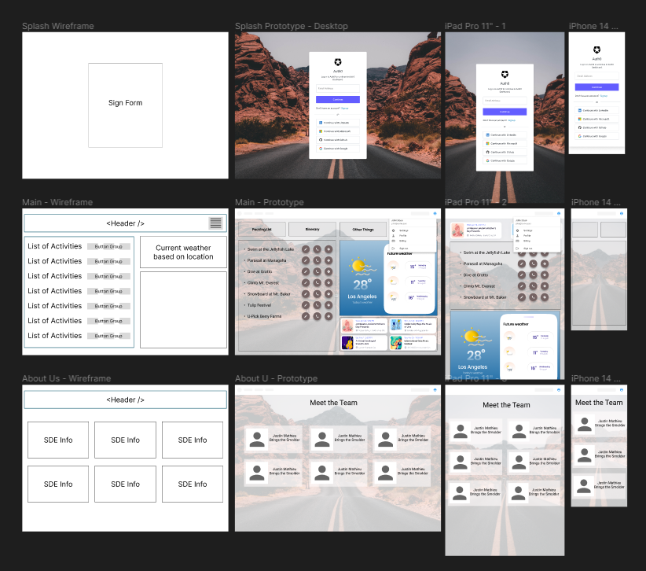

# Adventure Time

## Collaborators

- Joshua Coffey
- Kenya Womack
- Justin Mathieu
- Tricia Sawyer
- Tim Maupin
- Donna Ada

## Problem Domain

When planning an adventure like hiking you always need to use multiple apps like a calendar, weather app, and a packing list. We aim to solve that problem by adding all of this things in one app.

## Process

- Create blank repo
- `npx create-react-app <your-app-name>`
- Push this app into blank repo

## Domain Modeling

## Wireframe

